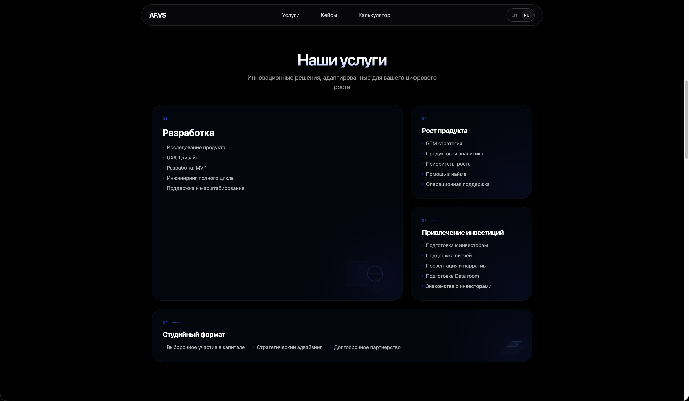
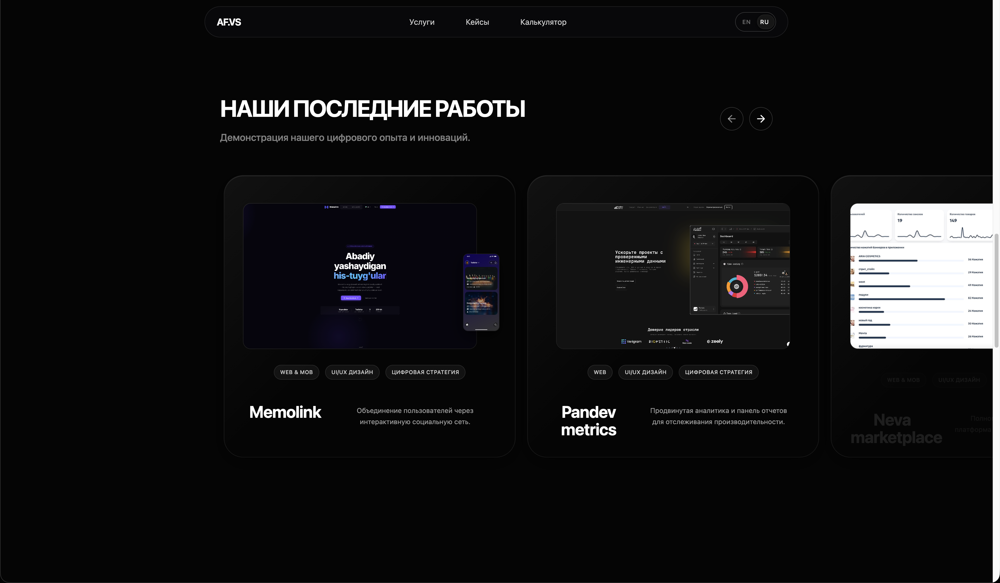
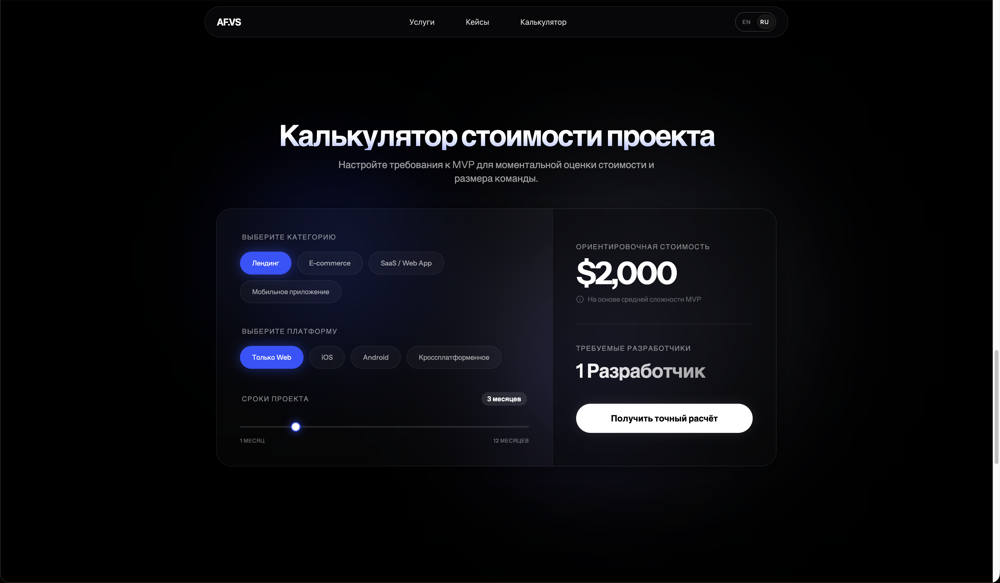

  
  <h3>af.vs_web</h3>
  
Инновационные решения, адаптированные для вашего цифрового роста

  

    
    
    
    
    
  

  

    
    
  

---

  <h3>О проекте</h3>
  

    <b>af.vs_web</b> — это лендинг сайт, разработанный для привлечения клиентов. 
    Проект использует архитектуру островов (Islands Architecture) для минимизации клиентского JavaScript и обеспечения молниеносной загрузки страниц. 
    В основе лежит мощный стек на базе Astro и Tailwind CSS 4, дополненный сложными анимациями и полной поддержкой мультиязычности (RU/EN).
  

  

  <h3>Секции</h3>

|  |  |  |  |
| --------------------------------------------- | ------------------------------------------------- | ---------------------------------------------- | --------------------------------------------------- |
| **Hero**                                      | **Services**                                      | **Portfolio**                                  | **Calculator**                                      |

  <h3>Структура</h3>

  <pre>
    af.vs_web/
    ├── src/
    │   ├── components/    # Секции сайта (Hero, Services, etc.)
    │   ├── i18n/          # Система интернационализации
    │   ├── layouts/       # Базовые шаблоны страниц
    │   ├── pages/         # Роутинг (включая /ru)
    │   └── styles/        # Глобальные стили и Tailwind
    └── public/            # Статические ресурсы
  </pre>

  <h3>Установка</h3>
  <pre>
    git clone https://github.com/Yuldshev/af.vs_web
    npm install
    npm run dev
  </pre>

